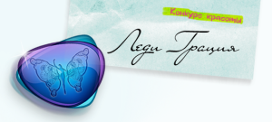

Конкурс красоты "Первая леди"
=============================

:date: 2010-12-06 10:04
:tags: php, zend_framework, mysql, html, jquery
:category: мои проекты
:slug: kk
:abstr: Сайт конкурса красоты "Первая леди".
:lang: ru

:Тех. стек: PHP, Zend Framework, `Whyte`_, MySQL, HTML, jQuery
:Время: ½ года
:Репозиторий: https://bitbucket.org/yentsun/kk
:Статус: неизвестен

Разработал сайт будучи удаленным сотрудником, полностью "с нуля" (бэкенд,
БД, фронтенд) за исключением дизайна.

Реализовано:

* каталог участниц с портфолио
* модуль голосования
* загрузка и обработка фото/видео-материалов
* регистрация с подтверждением по почте

.. _`Whyte`: {filename}/whyte.rst