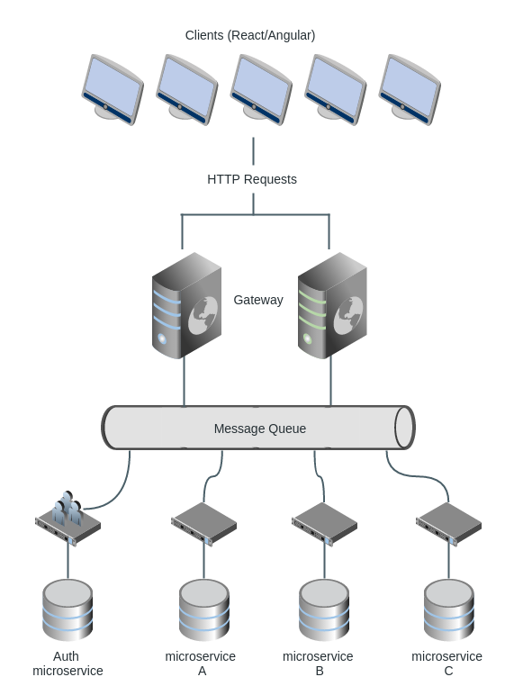

Microservices Example With Express And SenecaJS
###############################################

:date: 2016-05-29 13:26
:tags: nodejs, seneca, express, microservices
:category: webdev
:slug: express-seneca-example
:authors: Max Korinets
:abstr: So, you've heard all the hype about microservices and want to try them.
        But what to start from? Which tools to choose? How to set up
        communication between things? Here is an example with well known
        ExpressJS as HTTP-server and SenecaJS as microservice framework

:lang: en

The Diagram
-----------

Our clients (maybe React or Angular frontends) will make HTTP requests to the
*gateway*, which is a simple HTTP-server application. *The Gateway*, in turn,
will communicate to Seneca microservices via *message queue*. Each microservice
will have its own data storage.

The Tools
---------

We will use:

- ExpresJS_ as http-server to handle incoming requests and pass them as messages
  to the microservices, so we are calling it the *Gateway*
- RabbitMQ_ as the *Message Queue* (bus)
- SenecaJS_ as microservice framework
- MongoDB_ as data storage

Setting up the Gateway
----------------------

All our gateway needs to do is to serve the HTTP requests, *post* the
correspondent message to the message queue, wait for the response from message
queue and return HTTP response with relevant data. The incoming requests will be
authorized via one of the microservices (the *Auth microservice*).

ExpressJS is one good server for these tasks, but it can be any NodeJS
http-server actually. Detailed tutorial on how to create an HTTP-server with
ExpressJS falls out of scope of this article - there are hundreds of them
in the Internet. We'll focus only on the crucial parts of our system.

Imagine we have to handle user registration requests like this one
(cURL format)::

    curl -i -X POST -d '{"email":"test@user.com","name":"Test User"}' \
    'http://api.gateway.com/users'

... to be continued

.. _ExpresJS: http://expressjs.com/
.. _SenecaJS: http://senecajs.org/
.. _RabbitMQ: https://www.rabbitmq.com/
.. _MongoDB: https://www.mongodb.com/
