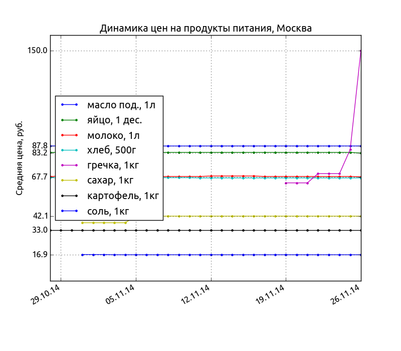

Milk Price Report
=================

:date: 2014-10-01 10:04
:tags: python, zodb, yaml
:category: мои проекты
:slug: milk-price-report
:abstr: Было ли вам когда-нибудь интересно узнать где в Москве самое дешевое
        молоко? Какая в Петербурге средняя цена на ржаной хлеб? Сколько в
        Новосибирске стоит килограмм картофеля? Проект `Milk Price Report`
        разрабатывается с целью ответить на эти вопросы. Отчеты о ценах
        собираются как с интернет-магазинов, так и от пользователей.
:lang: ru

.. role:: price

:Тех. стек: Python, ZODB, YAML, numpy, matplotlib
:Репозиторий: https://bitbucket.org/yentsun/milk-price-report

Средняя цена расчитывается с помощью `медианы`_ дабы исключить влияние
экстремальных пиков.

Также, в расчет берется "нормированная" упаковка продукта. Например, если
упаковка молока 950 г стоит :price:`55.91`, то при расчете средней цены будет
учитываться цена этого молока за литр (литр - "нормированная" упаковка для
молока), то есть :price:`60.12`.

Есть следующие данные о ценах за последний месяц в Москве:

.. _`медианы`: https://ru.wikipedia.org/wiki/Медиана_(статистика)