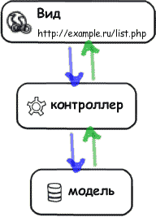
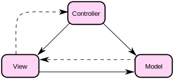

Раз и навсегда об MVC
#####################

:date: 2010-05-11 10:20
:tags: 37signals, CodeIgniter, MVC, symfony
:category: вебдев
:slug: the-mvc
:abstr: Знаете ли вы что такое Model-View-Controller? Если знаете – умеете ли
        правильно понимать и применять эту модель на практике? Нет ли ощущения
        недосказанности и неловкости насчет нее? В этом посте я пытаюсь
        расставить все на свои места.
:lang: ru

Столкнувшись впервые с MVC-моделью в разработке веб-приложений (Ruby On Rails),
я не сразу понял идею. Вроде «что-то где-то отделено от другого и это лучше чем
все в кучу». Поняв тогда, что не смогу осилить этот фреймворк – снова вернулся
к MODx и PHP . Спустя пару лет услышал о symfony и твердо решил изучить ее, раз
уж среда с моделью MVC существует и для родного бюджетного PHP.

`Определение из Википедии
<http://ru.wikipedia.org/wiki/Model-View-Controller>`_:

    Model-view-controller (MVC, «Модель-представление-поведение»,
    «Модель-представление-контроллер») — архитектура программного обеспечения,
    в которой модель данных приложения, пользовательский интерфейс и
    управляющая логика разделены на три отдельных компонента, так, что
    модификация одного из компонентов оказывает минимальное воздействие на
    другие компоненты.

Итак, я стал понимать что модель – вроде как, «модель данных» для БД, вид –
просто HTML-шаблон с указанием мест вывода данных, а контроллер – связующее
между ними звено. То есть:

1. Пользователь запрашивает некий url
2. Вид, соответствующий этому url, обращается к контроллеру
3. Контроллер обрабатывает запрос и получает данные из модели (?) и, возможно,
   обрабатывает уже полученные данные
4. Контроллер отсылает данные в вид
5. Пользователь видит шаблон с данными

Вроде как, все понятно – можно изобразить работу этой модели следующей схемой:

Схема, иллюстрирующая модель в Википедии выглядит же вот как:

Если прочитать оттуда же следующее утверждение:

    Важно отметить, что как представление, так и поведение зависят от модели.
    Однако модель не зависит ни от представления, ни от поведения. Это одно из
    ключевых достоинств подобного разделения.

...то, например, у меня происходит легкий диссонанс. Вроде как, "модель не
зависит ни от вида, ни от контроллера". На схеме от Википедии видны «прямая
связь» и направление от вида к модели, то есть вид напрямую влияет (а может
передает данные) модели? То ли я неправильно читаю схему, то ли в определении
от Википедии закралась ошибка, то ли неизвестный третий фактор.

Не смотря на все это, я все-таки начал работу и построил небольшое приложение
на symfony. Я усиленно пользовался видео-уроками и читал блоги на эту тему.
Сейчас я не помню на 100%, но, вроде бы, вся бизнес-логика (обработка данных,
перекрестный сбор их и прочее) там содержалась в контроллерах. «Модель» была
просто структурой данных в БД (по сути конфиг-файл). С этими знаниями я перешел
к разработке в CodeIgniter.

В этом фреймворке, славящимся своей быстротой и гибкостью, бизнес-логика может
содержаться как в модели так и в контроллере. Это слегка сбило меня с толку.
В процессе работы вышло само-собой, что модель (по аналогии с опытом symfony) у
меня лишь содержала сбор данных из БД, а основным рабочим блоком были
контроллеры. А иной раз выходило, что часть бызнес-логики попадала в модель…
Вобщем, намечался небольшой бардак.

И вот, совсем недавно, подписавшись на новостную рассылку от thinkvitamin.com,
я получил в качестве подарка 44 страницы резюме докладов Райана Сингера,
ведущего дизайнера интерфейсов из 37signals. Скажу сразу, для меня интерфейсы
приложений от этой студии (basecamp и др.) являются эталоном и объектом
поклонения. И как же хорошо, что он и слушатели подняли тему MVC! Все сразу
встало на свои места.

    | Think of the model like this:
    | What are the things our app needs to
      keep track of, and how do they relate to
      each other?

и еще – модель в словах:

    | There are projects and each project has
      messages, to-do lists, and milestones.”
    | “Messages can have comments.”
    | “To-do lists are made up of to-do items.

Довольно грязный дословный перевод:
модель – это все те вещи, которые ваше приложение должно
отслеживать/обрабатывать и как эти вещи соотносятся друг с другом. Теперь,
собрав мысли в новое определение, получаем:

* **модель** содержит всю бизнес-логику приложения – никаких лишних шестеренок
  в контроллере или виде.
* **контроллер** – просто как драйвер между устройством и компьютером –
  выполняет в основном «спинно-мозговые» и транспортные операции (upd: если
  представить, что ваше приложение будет работать не для веб-браузера, а для
  десктопа – по идее, вы просто должны заменить контроллер)
* **вид** – (x)html-шаблон, с которым в большей степени работает уже
  дизайнер-верстальщик, чем меньше там программного кода вообще, тем лучше

Я лично следующий свой проект буду начинать с бóльшим воодушевлением, чем
раньше. Одним бардаком меньше.