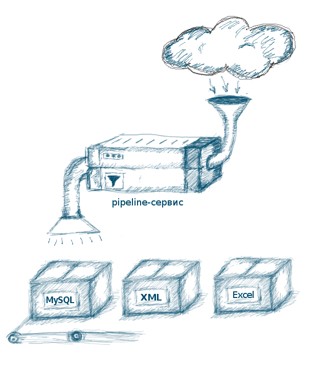

========
Hire me!
========

:sort_order: 6
:slug: services
:lang: en

.. role:: usd

I can do the following:

====================================  =============  ==================
job                                   time           approx. cost
====================================  =============  ==================
`complete web application`_           1 month        :usd:`2000`
`web server launch`_                  1 day          :usd:`300`
`one time data transfer`_             2 days         :usd:`300`
`data transfer service`_              1 week         :usd:`1000`
miscellaneous                         1 hour         :usd:`20`
====================================  =============  ==================

.. note:: If your project involves a technology of my
          `current interests <{filename}/pages/cv.rst#current-interests>`_ -
          you'll have a **20% discount**

.. _complete web application:

Complete web application
========================

I can develop a web application of almost any scale -- from a small
business website to a full blown high-load enterprise platform. The webapp
could include modules like:

* news feed
* catalog / picture gallery
* custom admin panel
* accounts with authenticating/authorization
* mail sending
* popular services integration (Google+, Flickr, Facebook)
* well-documented API

Any of my `skills <{filename}/pages/cv.rst#skills>`_ can be applied for the
development.

.. _one time data transfer:

One time data transfer
======================

* You need to import a catalog from an xml-feed to your MongoDB storage?
* You need to scrap some data from a website into an Excel table?

I have experience in that. Any data in any format can be transferred anywhere
to any other format. Some of the common formats I used to work with:

* HTML (web-pages)
* Excel, CSV
* XML, JSON, YAML
* text files
* encrypted/zipped packages

.. _data transfer service:

Data transfer service
=====================

If you need to transfer data on a regular basis, you need a `data transfer
service` (or pipeline). I can develop and launch it on your resource or on
mine and set it to fetch the data daily, hourly or even every second and send
it to your storage.

Some of the transfer schemes:

* XML feed --> your app MySQL database
* Excel table -> your JSON feed with fields named differently
* foreign API --> aggregated data for yor own API

.. _`web server launch`:

Web server launch
=================

* You need to launch a Linux webserver today?
* Want to use the power of AWS, but confused where to start from?

I can assemble and tweak a server for you, be it a hosting of your choice or
mine. Or AWS instance.
