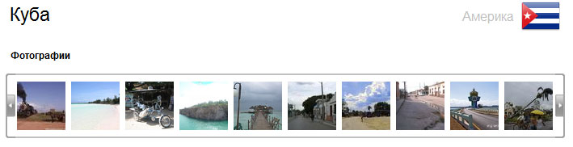

Краткое руководство по Panoramio API
####################################

:date: 2010-05-06 10:20
:tags: api, обзор
:category: webdev
:slug: panoramio-api
:abstr: В процессе работы над одним туристическим сайтом столкнулся  с
        необходимостью оформлять страну или курорт с помощью фотографий.
        Понятное дело – придумал механизм загрузки фото и готово.  Где нам
        взять много красивых картинок какого-нибудь живописного места? Из
        интернета же – можно найти по тегу во Фликре, например, можно в Пикасе.
        Найдем, скачаем себе и загрузим на наш тур-сайт. Непыльно и достаточно
        интересно. Но что если у вас есть тяга все автоматизировать?
:lang: ru

Что если вы хотите исключить из цепочки действий (выше) поиск, скачку и
загрузку на сайт фотографий? Скажем, зададим страну или курорт на карте Google
и пусть фотографии волшебным образом появятся на сайте сами. Хорошие новости –
это вполне себе возможно, даже очень просто с помощью сервиса `Panoramio
<http://www.panoramio.com/>`_.

Этот сервис позволяет выдать набор фотографий по заданному географическому
«квадрату». Если у вас на сайте географические локации хранятся в формате
Google Maps (как и у меня), то достаточно «нарастить» квадрат от точки-центра,
задав нужный размер квадрата. У меня он разный для стран и курортов.

Пример. Куба задана в базе следующими координатами ``21.637005211106306``,
``-77.76123046875`` (просто произвольная точка на ее территории). Нарастим
квадрат в один градус широты и долготы (примерно 100 км от центра, так как
земля не шар, а эллипс – точные вычисления достаточно сложны) и получим::

    maxX: -76.76123046875
    maxY: 22.637005211106306
    minX: -78.76123046875
    minY: 20.637005211106306

Теперь достаточно создать GET-запрос к сервису Panoramio::

    http://www.panoramio.com/map/get_panoramas.php?order=popularity&set=public&from
    =0&to=27&minx=-78.76123046875&miny=20.637005211106306&maxx=-76.76123046875
    &maxy=22.637005211106306&size=square&callback=?

В ответ мы получим JSON-данные о фотографиях, типа:

.. code-block:: javascript

    {
      "count": 773840,"photos": [
        {
          "photo_id": 532693,
          "photo_title": "Wheatfield in afternoon light",
          "photo_url": "http://www.panoramio.com/photo/532693",
          "photo_file_url": "http://static2.bareka.com/photos/medium/532693.jpg",
          "longitude": 11.280727,
          "latitude": 59.643198,
          "width": 500,
          "height": 333,
          "upload_date": "22 January 2007",
          "owner_id": 39160,
          "owner_name": "Snemann",
          "owner_url": "http://www.panoramio.com/user/39160",
        },
        {
          "photo_id": 505229,
          "photo_title": "Etangs près de Dijon",
          "photo_url": "http://www.panoramio.com/photo/505229",
          "photo_file_url": "http://static2.bareka.com/photos/medium/505229.jpg",
          "longitude": 5.168552,
          "latitude": 47.312642,
          "width": 350,
          "height": 500,
          "upload_date": "20 January 2007",
          "owner_id": 78506,
          "owner_name": "Philippe Stoop",
          "owner_url": "http://www.panoramio.com/user/78506"
        }, ...
      ]
    }

С помощью несложной функции (jQuery) можно налету сформировать галерею:

.. code-block:: javascript

    $.getJSON(url,function(data) {
        if (data.photos.length>0) {
            $(data.photos).each(function() {
                $(target).append('
                    ');
            });
        }
    });

url – как раз наш GET-запрос

Самое главное – не забыть указать на сайте, что фото отображены с помощью
сервиса Panoramio и их полные версии должны иметь ссылку на оригинальное фото.

Подробнее на `официальном сайте <http://www.panoramio.com/api/>`_.