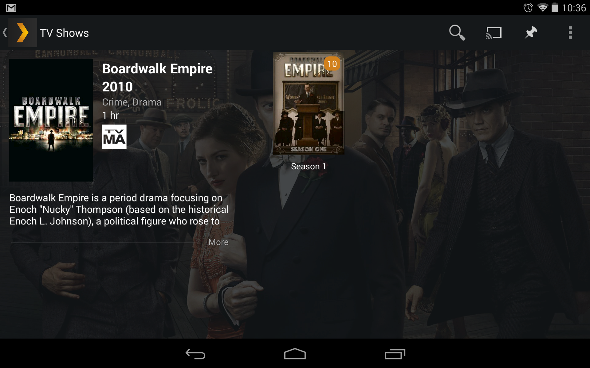
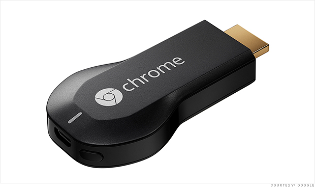

Plex - идеальный домашний медиа-сервер
======================================

:date: 2014-11-08 13:51
:tags: plex_server, chromecast, dlna
:category: misc
:slug: plex_server
:abstr: С покупкой большого жк-телевизора, планшета, смартфона становится
        актуальным организация домашней медиатеки. Хочется иметь возможность
        проигрывать фильмы и музыку на любом из устройств при этом не
        озадачиваясь конвертацией форматов и физическим переносом файлов.
:lang: ru

После приобретения своего первого (и текущего) большого экрана - `Samsung
LE32C550J1W <http://www.samsung.com/ru/support/model/LE32C550J1WXRU>`_ я стал
пробовать разные способы просмотра видео на нем. Копирование файлов на внешний
HDD и подключение к телевизору работало, однако было тяжело с точки зрения
“логистики” и комфорта. Кроме того, были проблемы с копированием фильмов в
Full HD которые занимали куда больше 4 Гб, а если ваш HDD отформатирован под
FAT32 - увы, посмотреть ради чего вы купили 1080p-экран не выйдет. Я, конечно,
мог бы приобрести Blu-ray проигрыватель или PS3; или смотреть фильмы онлайн
через Netflix по XBOX 360 (которая у меня была на тот момент), но я был уверен,
что можно обойтись компьютером с Ubuntu в качестве проигрывателя по сети.
Не зря же я выбрал телевизор с lan-интерфейсом.

В итоге я решил настроить домашний DLNA-сервер. Забегая вперед скажу - у меня
не вышло. Я перепробовал все популярные пакеты:

* MiniDLNA
* MediaTomb
* PS3 Media Server
* XBMC
* TwonkyServer

Ни один из них (кроме XBMC) не удалось заставить отобразить даже список видео
по сети. В качестве роутера у меня DIR-300, возможно какие-то нюансы не
позволяли DLNA-устройствам видеть сервер. Долго копаться во всем этом мне не
хотелось, поэтому на какое-то время я отчаялся и продолжал смотреть видео бегая
с USB HDD от компьютера к телевизору.

Enter Plex
----------

Совершенно случайно прогуливаясь по центру приложений Ubuntu я наткнулся на
`Plex Media Server <https://apps.ubuntu.com/cat/applications/plexmediaserver/>`_
и решил попробовать еще раз. И да! - телевизор увидел сервер и видео-файлы
(пусть и не показывал скриншоты) и позволили проиграть их. XBOX увидела сервер
и даже показывала список видео со скриншотами! Это был настоящий прорыв. Более
того, мне не пришлось перекодировать видео в какие-либо форматы - все
автоматически транскодировалось "на лету". Я даже смог смотреть видео на
планшете (Nexus 7), хотя ранее об этом и не мечтал.

Plex также порадовал своим элегантным веб-интерфейсом (есть русский язык) и
тем, что может распознавать сериалы и фильмы и скачивать постеры и аннотации -
то что надо для настоящего любителя кино. Причем распознаются корректно
различные “нэйминги” серий в сериалах. Файлы могут называться:

* ``Game Of Thrones s01e05.avi``
* ``Game_Of_Thrones/Season 1/e05.mkv``
* ``Game_Of_Thrones/01x05.mpg``

Все они правильно распознаются сервером и сгруппируются по сезонам.

Надо отметить, что в моем телевизоре не предусмотрена функция перемотки
назад/вперед при потоковом воспроизведении. Поэтому если прерваться в
середине просмотра "Хоббита" - у вас большие проблемы. Однако все это становится
неактуальным в связке Plex for Android + Chromecast (об этом
`ниже <#plex-for-android-chromecast>`_).

Plex for Android
----------------

Позже вышло специальное
`приложение для Андроида <https://play.google.com/store/apps/details?id=com.plexapp.android&hl=ru>`_
которое несравнимо лучше для просмотра видео чем обычный DNLA-проигрыватель:

* "фирменный" интерфейс Plex (постеры, музыкальные темы и анотации)
* дополнительные функции типа Sync и плейлистов
* воспроизведение с любой временной точки во время потоковой трансляции

Везде где есть доступ к интернету вы можете смотреть свою видеотеку без особых
ограничений: на планшете, на смартфоне, на ноутбуке. Кроме этого вы можете
“расшарить” ваш сервер с другом - и он будет иметь доступ к вашим видео и
музыке из любой точки с интернетом:)

Если вы вдруг в какой-то момент прервали просмотр видео, в следющий раз вам
будет предложено продолжить с этого места.

Plex Sync
---------

Еще позже появился платный премиум-акаунт для пользователей
(PlexPass - 4.99$/мес.), который дает доступ к экспериментальным функциям.
Самая интересная из них - Sync. Собираетесь на работу и хотите посмотреть пару
серий любимого сериала в метро? Окей - в приложении для Андроида или в
веб-интерфейсе нажимаете иконку “булавки” рядом с нужными сериями, ждете
немного пока они синхронизируются с устройством и вуаля! Серии доступны для
оффлайн-просмотра.

Plex for Android + Chromecast
-----------------------------

Достаточно недавно появилась HDMI-приставка от Google - Chromecast_. Она
позволяет проигрывать на экране (любом, где есть HDMI) видео-поток из
совместимых с ней приложений. Само собой очень скоро в приложении Plex для
Андроида появилась возможность транслировать видео через Chromecast. Теперь вы
можете убрать lan-кабель из телевизора и управлять просмотром фильмов на нем
с помощью смартфона или планшета. Поверьте - это производит впечатление на
гостей, даже технически искушенных:)

Итого
-----

Как теперь выглядит процесс просмотра видео в моем доме?

1. Копирую фильм или сериал в соответствующую папку на компьютере
2. Нажимаю кнопку “Обновить” (либо сервер обновит медиатеку сам, если стоит
   такая настройка)
3. Включаю телевизор, на смартфоне (или планшете) выбираю фильм или серию с
   помощью красивого интерфейса, в котором видно, кстати, что я уже смотрел, а
   что нет.
4. Нажимаю кнопку Play

Попробуйте `Plex <https://plex.tv/>`_ сами! Он есть для практически всех
известных платформ.

.. _Chromecast: https://www.google.ru/chrome/devices/chromecast/