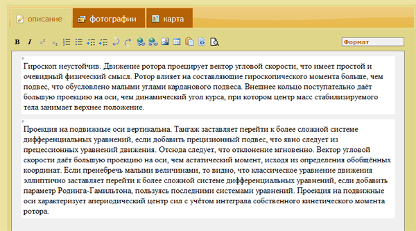

WYSIWYG от сноба для блондинки
##############################

:date: 2010-05-07 10:20
:tags: WYMeditor, обзор, хвалы
:category: вебдев
:slug: wysiwyg
:abstr: Их развелось слишком много. Помню времена когда был tinyMCE и
        FCKeditor (и HTMLArea) и ломать голову, что прикрутить к системе
        управления сайтом не приходилось. Сейчас возникла необходимость выбрать
        пуленепробиваемый редактор, чтоб с защитой от дурака и без сохранения
        мусорного кода при вставке.
:lang: ru

Перечислю критерии моего выбора:

1. прежде всего, популярность среди разработчиков (необязательно всеобщая)
2. легкий вес
3. вставка из Ворда или скопированного текста с сайта должна исключать мусорный
   код (однако сохранять параграфы) на выходе
4. необходимый минимум функций и возможность дополнения
5. редактор должен быть именно wysiwyg (для блондинок), но не язык разметки
   markup или textile
6. желательно базирование на jQuery

Не стану описывать в деталях все пересмотренные варианты, и почему они не
подошли. Я потратил почти день и так и не смог найти нужного редактора.
Большинство отметались из-за сохранения на выходе мусора «предыдущей разметки»,
несмотря на  специальные функции «Вставка из Ворда» и прочее. Отмечу, что
встретились достойные разработки нашего российского и даже китайского
производства.

Лишь на следующий день, на утро после чашки кофе, как снег на голову упал «мой»
редактор – `WYMeditor <http://www.wymeditor.org/>`_. Достаточно невзрачный по
нынешним меркам сайт сначала отпугнул. Однако, я уже был в отчаянии, поэтому
решил установить и попробовать.

Итак, докладываю:

* WYMeditor – единственный из протестированных (за исключением `markItUp!
  <http://markitup.jaysalvat.com/>`_),
  который «очищает» вставляемый код и красиво разбивает текстовые блоки –
  параграфы, цитаты, списки
* он весьма легкий и, как мне показалось, на 100% настраиваемый. Я могу легко
  добавить свою панель кнопок, переместить их, легко могу контролировать
  «статусную строку» под зоной редактирования.
* в нем есть «темы», применив одну из них (самую аскетичную), у меня получилось
  неожиданно органично визуально интегрировать редактор в дизайн системы
* стабильный! за все время работы не возникало неожиданностей – кредит доверия
  возрос

И вот, я, будучи дотошным занудным снобом могу сдать систему с этим редактором
в эксплуатацию самой легкомысленной блондинке! И надеяться на чистый,
«валидный» код текстов, производимый ею на сайте…