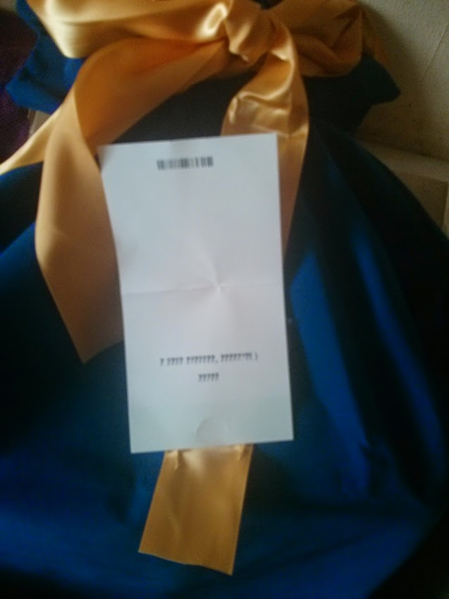
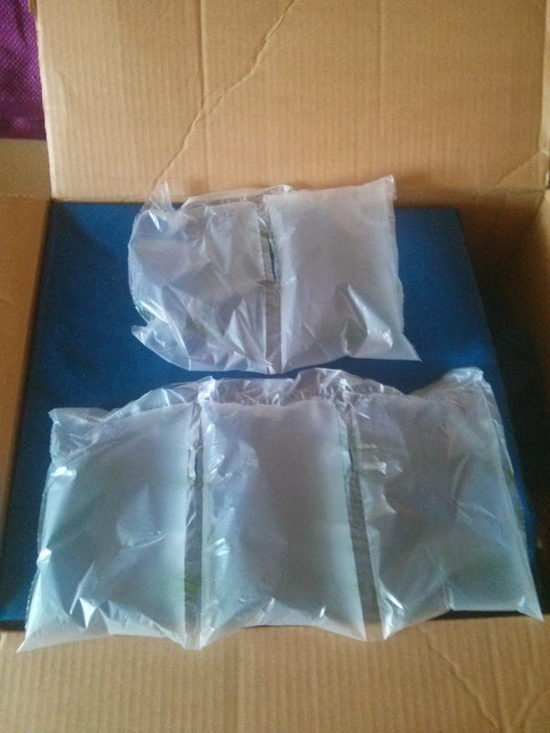
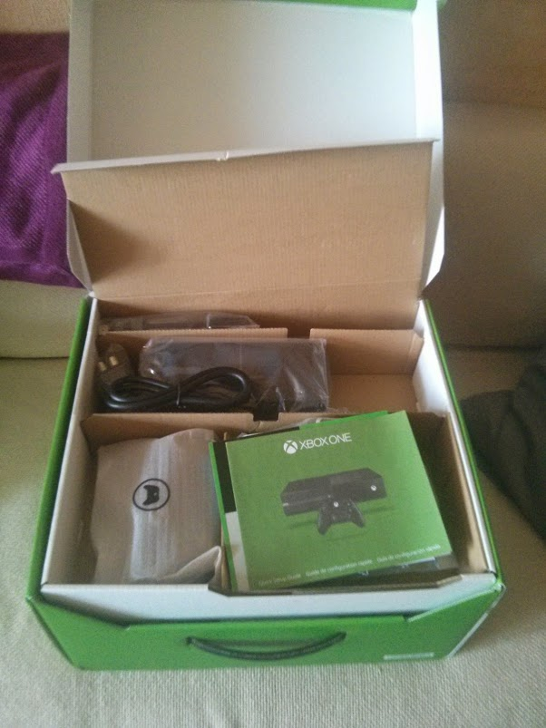
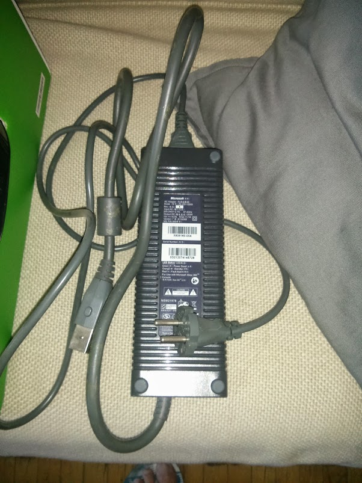
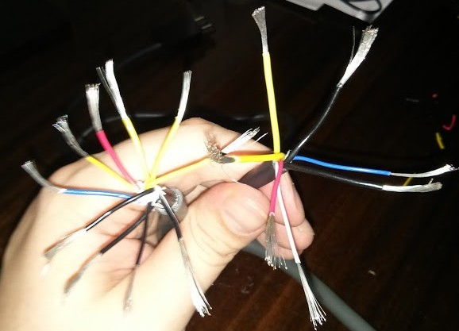
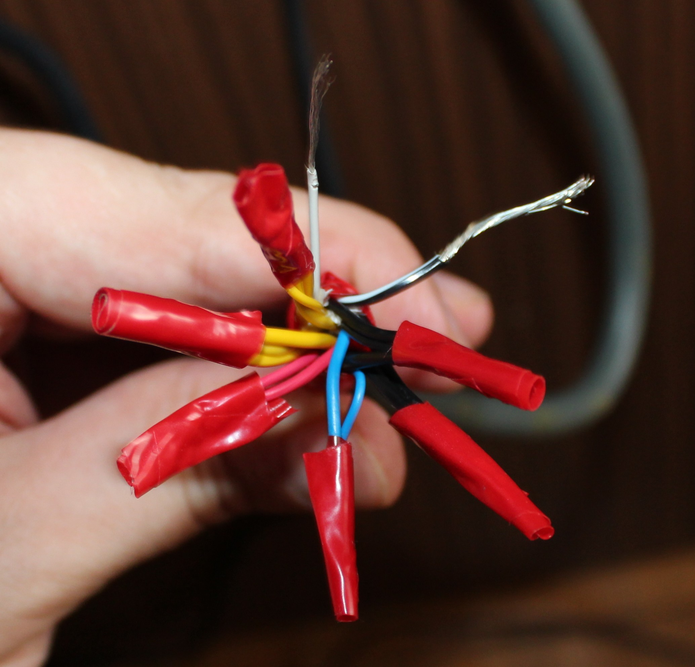

Xbox One! Еще не в России
=========================

:date: 2014-08-01 12:02
:tags: xbox, amazon
:category: gaming
:slug: xbox-one
:abstr: Вчера стал счастливым обладателем `Xbox One` за пару месяцев до ее
        официального выхода в России. Счастье мое было бы безграничным, если бы
        не некоторые нюансы и не ситуация, где понадобилась пара чистых штанов.
:lang: ru

Встретив солидного курьера UPS, который не мог полчаса ко мне достучаться по
причине того, что я в наушниках резался в Battlefield 4, я набросился на
распаковку посылки.

Так как это был подарок (от прекрасной `+Ирины Гераскиной`_) - коробка была
оформлена в бархатный мешок с желтой лентой. Увы, поздравление со словами любви
по причине кодировок не было прочитано, зато вызвало много умиления.

Также, восторг вызвали пакетики с воздухом, вложенные в коробку для уплотнения.
Тривиальная идея, но я вижу такое в первый раз:

Моя комплектация была достаточно скромной - там были:

* гарнитура
* джойстик
* консоль
* блок питания
* кабель HDMI

Там не было `Kinect` (хотя я свято верил в то, что они обязательны для любой
комплектации) и не было каких либо игр. Ну да ничего, подумал я - главное
запустить консоль, да насладиться новым интерфейсом.

Быстро подключил все узлы куда нужно, для американской розетки чудом нашел
переходник и не пришлось бежать в магазин. Вставляю вилку в розетку...
Комфортно располагаюсь на диване... Бах! Хлопок! Облачко дыма и запах паленой
дорогостоящей электроники.

Не стану в деталях описывать всю гамму пережитых эмоций. Все оказалось просто
- блок питания расчитан на 100-127 Вольт, а не на наши 220. Причем у всех Xbox
360 (и у PS3/4) блоки питания универсальные, а тут раз - и нет. Придя в себя,
я срочно начал искать пути разрешения ситуации.

Для начала погуглил и понял, что это очень частая проблема у купивших One в
штатах и привезших ее играть в Европу. Также на это попались и наши
соотечественники, заказавшие, как и в моем случае, консоль через Amazon.

Решения обрели следующие направления:

* **если нет других блоков питания**

  + `починить сгоревший <http://www.xboxland.net/forum/topic/117027-решение-проблемы-американского-блока-питания/?p=3475210>`_
  + `переделать еще не сгоревший <http://www.xboxland.net/forum/topic/120298-%D0%BA%D0%B0%D0%BA-%D0%BF%D0%B5%D1%80%D0%B5%D0%B4%D0%B5%D0%BB%D0%B0%D1%82%D1%8C-%D0%B0%D0%BC%D0%B5%D1%80%D0%B8%D0%BA%D0%B0%D0%BD%D1%81%D0%BA%D0%B8%D0%B9-%D0%B1%D0%BF-110%D0%B2-%D0%BE%D1%82-xbox-one-%D0%B2-220%D0%B2/>`_
  + `купить "китайский" <http://www.gameunleashed.ru/xn001.html>`_
  + ждать выхода консоли в России и приобретать оригинальный

* **если есть старый блок питания от Xbox 360 (Xenon)**

  + `купить переходник <http://www.amazon.com/Pythons-Supply-Convert-Adapter-Xbox-One/dp/B00HLLWU2M>`_
  + перепаять провода для нового штекера
  + разрезать кабели и просто скрутить соответствующие провода

Так как у меня пылился старый БП от Xbox 360 (Xenon), а
переделывать/перепаивать у меня не хватало квалификации, я выбрал
скрутку проводов "старый блок + новый штекер". Знаю, что скрутка не самый
надежный способ и лучше выбрать какой-то другой.

Итак:

1. Разрезаем кабель от БП Xbox 360
2. Разрезаем кабель от БП Xbox One
3. Снимаем изоляцию у обеих кабелей. Сначала снимаем общую, потом оголяем
   каждый провод на 1 см приблизительно.
4. Максимально плотно скручиваем провода:

   * 4 желтых от 360 с 2-мя желтыми от One (12 Вольт)
   * 1 красный от 360 с 1-им красным от One (5 вольт)
   * 1 синий с 1-им синим
   * 3 черных от 360 с 2 черными от One (Земля)
   * 1 серый от 360 c 1 черным с белой полосой от One (?)

5. Скрученные участки покрываем плотно изолентой
6. Весь "пучок" плотно покрываем изолентой и максимально фиксируем

Подсоединив полученный провод с БП к Xbox One, я запустил ее!

Кстати, то ли у меня бракованный джойстик, то ли это так и задумано -
светящаяся кнопка Xbox реагирует только на очень сильное давление. Я долго
думал что джойстик вообще не рабочий.

И еще у меня Gold-аккаунт, и я все же получил пару веселых бесплатных
игр.

.. _`+Ирины Гераскиной`: https://plus.google.com/112738381324206295352
